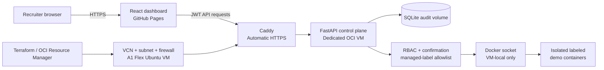

# Wilson Lab

A security-conscious infrastructure control-plane showcase built to demonstrate product thinking, technical discovery, API design, authorization, operational safety, infrastructure as code, and clear communication.

**Live dashboard:** https://cbw29512.github.io/wilson-lab/

## What it demonstrates

- A modern React 19 and TypeScript dashboard
- Searchable and filterable infrastructure inventory
- Clear live-versus-demo data state
- FastAPI control-plane API integration
- Signed JWT authentication with session-scoped browser storage
- Viewer and Administrator roles
- Role-aware resource controls and details
- Explicit confirmation before state-changing operations
- Allowlisted start, stop, and restart actions
- SQLite-backed action requests and audit history
- Mock and Docker runtime adapters
- Frontend response validation and safe API fallback
- Automatic HTTPS deployment through Caddy
- File-backed production secrets
- Backup and integrity-checked restore workflows
- Terraform-managed Oracle Cloud network and compute resources
- Automated frontend, backend, deployment, and infrastructure CI

## Current milestone

| Milestone | Status | Result |
|---|---|---|
| M0 — Repository foundation | Complete | Documentation, CI, Pages deployment, hooks |
| M1 — Dashboard | Complete | Resource cards, search, filters, sorting, UTC timestamps |
| M2 — Secure API foundation | Complete | Auth, RBAC, inventory, operations, audit trail, tests |
| M3 — Frontend/API integration | Complete | Login, live-data state, role-aware controls, confirmation, details, audit panel |
| M4 — Cloud deployment bundle | Complete | Caddy HTTPS, hardened Compose stack, secrets, backups, preflight, deployment CI |
| M5 — OCI infrastructure as code | Complete in PR #4 | VCN, firewall, A1 VM, Ubuntu image selection, cloud-init, Resource Manager runbook |
| M6 — Live activation | External step | Activate OCI account, apply stack, create DNS record, connect Pages to API |

## Architecture



The Docker adapter only sees containers labeled `wilson-lab.managed=true`. It exposes no shell execution, container creation, deletion, image pulling, or arbitrary Docker commands. The Docker-backed stack belongs only on a dedicated disposable VM.

## Dashboard behavior

- The public GitHub Pages site always remains useful with validated demo inventory.
- When an API is reachable, the dashboard offers Viewer or Administrator sign-in.
- A valid session switches the inventory source to live data.
- Viewer accounts remain read-only.
- Administrator actions require explicit confirmation and refresh the audit timeline.
- Invalid or expired sessions are cleared and returned to demo mode.
- The frontend contains no embedded credentials.

## Local quick start

### Backend

```bash
cd backend
python -m venv .venv
source .venv/bin/activate
pip install -e ".[test]"
cp .env.example .env
uvicorn app.main:app --reload --port 8055
```

PowerShell:

```powershell
cd backend
py -3.12 -m venv .venv
.\.venv\Scripts\Activate.ps1
pip install -e ".[test]"
Copy-Item .env.example .env
uvicorn app.main:app --reload --port 8055
```

### Frontend

Open a second terminal:

```bash
cd frontend
npm ci
npm run dev
```

The Vite development server proxies `/api` and `/health` to `http://127.0.0.1:8055`.

## Cloud deployment

Two versioned layers make activation repeatable:

1. [`infra/oci/`](infra/oci/README.md) provisions the Oracle Cloud VCN, subnet, firewall, public IP, and Ubuntu A1 Flex instance through Terraform or OCI Resource Manager.
2. [`deploy/`](deploy/README.md) installs Caddy, the API, persistent data, secrets, backups, and isolated demonstration containers on that VM.

The OCI Terraform module includes:

- Resource Manager and local API-key authentication modes
- dynamically selected Canonical Ubuntu ARM image
- SSH limited to one `/32` administrator address
- public web ingress limited to ports 80 and 443
- a 1 OCPU / 6 GB / 50 GB default configuration
- cloud-init that installs Docker and starts Wilson Lab
- Terraform formatting and validation CI
- a packaged Resource Manager artifact

Actual activation still requires an OCI account and a DNS name controlled by the user.

## Validate

```bash
cd frontend
npm ci
npm run check

cd ../backend
pip install -e ".[test]"
pytest

cd ../infra/oci
terraform fmt -check
terraform init -backend=false
terraform validate
```

Deployment CI separately validates the Compose stack, Caddyfile, shell scripts, hardened API image, and non-root container identity.

## Security model

Wilson Lab is intentionally narrow:

- Viewer accounts can inspect inventory but cannot change state.
- Administrator accounts can request only valid start, stop, or restart transitions.
- Every state-changing request requires explicit confirmation.
- Every success and failure produces an audit record.
- Docker resources are checked against the management label before use.
- Production startup rejects weak, default, duplicate, missing, or unreadable secrets.
- OCI security rules expose SSH only to a supplied `/32` and web traffic only on 80/443.
- The Docker-backed mode belongs on a dedicated cloud sandbox, never a home or production host.

See [`docs/SECURITY.md`](docs/SECURITY.md) for the threat model, [`backend/README.md`](backend/README.md) for API setup, [`deploy/README.md`](deploy/README.md) for cloud operations, and [`infra/oci/README.md`](infra/oci/README.md) for Oracle activation.

## Documentation

- [`docs/ARCHITECTURE.md`](docs/ARCHITECTURE.md) — components and trust boundaries
- [`docs/SECURITY.md`](docs/SECURITY.md) — threats, controls, and accepted risks
- [`docs/BUILD_LOG.md`](docs/BUILD_LOG.md) — chronological engineering record
- [`docs/DEMO_SCRIPT.md`](docs/DEMO_SCRIPT.md) — interview demonstration flow
- [`backend/README.md`](backend/README.md) — API endpoints and local setup
- [`deploy/README.md`](deploy/README.md) — cloud deployment and recovery runbook
- [`infra/oci/README.md`](infra/oci/README.md) — Oracle Resource Manager and Terraform activation
