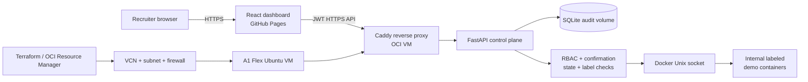
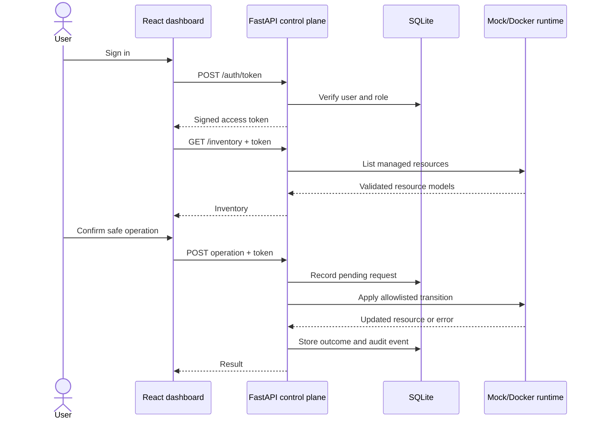

# Wilson Lab Architecture

## Goal

Build an interview-ready infrastructure control plane that demonstrates how a customer-facing technical professional can translate operational risk into a usable, secure product experience.

## Components

### React dashboard

- React 19, TypeScript, and Vite
- Hosted as static assets on GitHub Pages
- Search, tag filters, sorting, status indicators, and resource cards
- Viewer and Administrator login
- Live-versus-demo data indicator
- Resource details, confirmation, role-aware operations, and audit history
- Contains no API secrets or embedded credentials

### FastAPI control plane

- OAuth2 password login with signed JWT access tokens
- Viewer and Administrator roles
- Pydantic request and response validation
- Authenticated inventory and resource details
- Explicit-confirmation operations
- Audit-history endpoint
- OpenAPI documentation at `/docs`

### Persistence

SQLite stores:

- users and roles
- action requests
- operation outcomes
- audit events

SQLite is intentionally selected for a single-instance showcase. A production service would use managed persistence, migrations, and centralized append-only audit storage.

### Runtime adapters

`MockRuntime` provides deterministic, safe resources for local development and CI.

`DockerRuntime` uses the Docker SDK but limits discovery and operations to containers labeled:

```text
wilson-lab.managed=true
```

The runtime interface accepts only structured `start`, `stop`, and `restart` operations. It does not accept raw commands.

### Cloud deployment layer

The provider-neutral Compose bundle supplies:

- Caddy automatic HTTPS
- a non-root FastAPI container
- file-backed secrets
- persistent audit and certificate volumes
- internal labeled demo services
- preflight, backup, restore, and update workflows

### OCI infrastructure layer

Terraform or OCI Resource Manager supplies:

- dedicated VCN and public subnet
- internet gateway and default route
- SSH ingress restricted to one `/32`
- public web ingress limited to ports 80 and 443
- `VM.Standard.A1.Flex` Ubuntu compute
- public IPv4 output for DNS
- cloud-init that installs Docker and starts Wilson Lab

The infrastructure and deployment layers remain separate: OCI Terraform creates the VM and network, while the Compose bundle configures the portable application stack on that VM.

## End-to-end topology



## Request flow



## Authorization matrix

| Capability | Viewer | Administrator |
|---|---:|---:|
| View inventory | Yes | Yes |
| View resource details | Yes | Yes |
| Start stopped managed container | No | Yes |
| Stop or restart running managed container | No | Yes |
| View audit history | No | Yes |
| Execute arbitrary command | No | No |

## Trust boundaries

1. GitHub Pages is public and untrusted; it holds no secrets.
2. Caddy is the only service exposed publicly on the VM.
3. The API is the authorization boundary and is reachable only through Caddy.
4. Role decisions are made from server-side user records, not browser claims.
5. Every operation requires explicit confirmation and a valid state transition.
6. Docker labels limit the resource set and are checked immediately before use.
7. Demo containers publish no host ports and use an internal network.
8. The OCI VM is disposable and isolated from personal, employer, and production systems.

## Data flow and failure behavior

- Invalid credentials return 401.
- Viewer operations return 403.
- Missing confirmation returns 409.
- Unknown resources return 404.
- Runtime inventory failures return 503.
- Invalid or failed operations return 409 and generate failed audit events.
- Frontend API responses are runtime-validated before entering React state.
- Expired sessions are cleared and returned to safe demo mode.
- Cloud API outages do not break the public dashboard.

## Deployment status

### Complete in code

- GitHub Pages dashboard
- FastAPI control plane
- mock and Docker runtimes
- secure Compose/Caddy deployment bundle
- OCI Terraform module and Resource Manager instructions
- frontend, backend, deployment, and infrastructure CI

### External activation remaining

- OCI account authentication
- Resource Manager Apply in the home region
- DNS `A` record
- cloud-init and HTTPS verification
- GitHub `VITE_API_ORIGIN` repository variable
- final screenshots and demonstration recording

See [`SECURITY.md`](SECURITY.md), [`../deploy/README.md`](../deploy/README.md), and [`../infra/oci/README.md`](../infra/oci/README.md).
