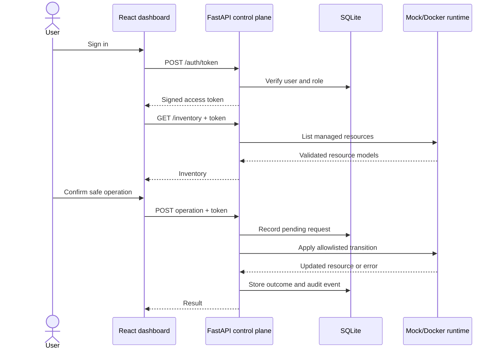

# Wilson Lab Architecture

## Goal

Build an interview-ready infrastructure control plane that demonstrates how a customer-facing technical professional can translate operational risk into a usable, secure product experience.

## Components

### React dashboard

- React 19, TypeScript, and Vite
- Hosted as static assets on GitHub Pages
- Search, tag filters, sorting, status indicators, and resource cards
- Contains no API secrets
- M3 will add login, live/mock source indicators, details, operations, and audit views

### FastAPI control plane

- OAuth2 password login with signed JWT access tokens
- Viewer and Administrator roles
- Pydantic request and response validation
- Authenticated inventory and resource details
- Explicit-confirmation operations
- Audit-history endpoint
- OpenAPI documentation at `/docs`

### Persistence

SQLite stores:

- users and roles
- action requests
- operation outcomes
- audit events

SQLite is intentionally selected for a single-instance showcase. A production service would use managed persistence and migrations.

### Runtime adapters

`MockRuntime` provides deterministic, safe resources for local development and CI.

`DockerRuntime` uses the Docker SDK but limits discovery and operations to containers labeled:

```text
wilson-lab.managed=true
```

The runtime interface accepts only structured `start`, `stop`, and `restart` operations. It does not accept raw commands.

## Request flow



## Authorization matrix

| Capability | Viewer | Administrator |
|---|---:|---:|
| View inventory | Yes | Yes |
| View resource details | Yes | Yes |
| Start stopped managed container | No | Yes |
| Stop or restart running managed container | No | Yes |
| View audit history | No | Yes |
| Execute arbitrary command | No | No |

## Trust boundaries

1. GitHub Pages is public and untrusted; it holds no secrets.
2. The API is the authorization boundary and must be served through HTTPS.
3. Role decisions are made from server-side user records, not browser claims.
4. Every operation requires explicit confirmation and a valid state transition.
5. Docker labels limit the resource set and are checked immediately before use.
6. The Docker-backed deployment belongs on a disposable cloud sandbox isolated from personal and production systems.

## Data flow and failure behavior

- Invalid credentials return 401.
- Viewer operations return 403.
- Missing confirmation returns 409.
- Unknown resources return 404.
- Runtime inventory failures return 503.
- Invalid or failed operations return 409 and generate failed audit events.
- API responses are validated against Pydantic models before reaching the dashboard.

## Deployment direction

### Current

- Dashboard: GitHub Pages
- API: local mock runtime during development
- CI: separate frontend build and backend compile/test workflows

### Planned cloud sandbox

- Dedicated Linux VM
- HTTPS reverse proxy
- FastAPI service bound privately
- Local Unix Docker socket only
- Small set of labeled demonstration containers
- Firewall-restricted administrative SSH
- No connectivity to home, employer, or production environments

See [`SECURITY.md`](SECURITY.md) for the threat model and accepted risks.
